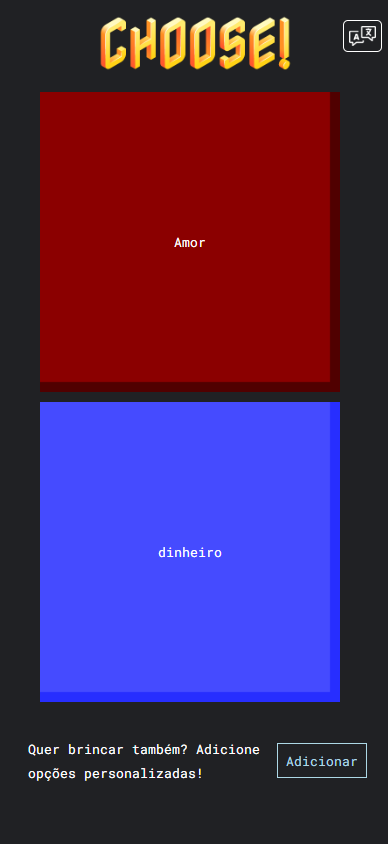
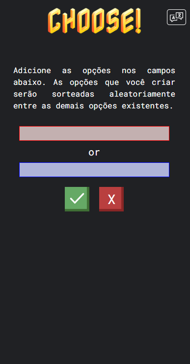

# Choose!

Este repositório contém o projeto da aplicação Web `Choose!`, que
consiste em um jogo simples onde o usuário deve escolher uma das opções
que aparecem nos botões.  
🟥Café ou 🟦Chá ?

# Como utilizar

Basta abrir o arquivo `index.html` em um navegador web ou mobile compatível.

# Sobre

A aplicação gerencia uma lista de questões que são sorteadas aleatoriamente e exibidas para o usuário como duas opções que ele pode escolher. Ao escolher uma opção, outra é sorteada e exibida nos botões. 
No canto superior direito, o botão [  ] permite alterar a linguagem do site, onde o cotrolador da aplicação altera os textos exibidos de acordo com o idioma atual. Por exemplo, se a linguagem for definida como `"br"`, os textos do app serão traduzidos para o português, se for definida como `"en"`, serão traduzidos para o inglês.  
Os textos e as questões para sorteio são organizados em um objeto e filtrados pelo idioma para exibição de acordo com a linguagem do site. Os dados de textos e as questões são armazenados no `Storage` da aplicação. 
Também é possível adicionar novas opções que serão sorteadas junto às demais existentes.

# Telas

<h3>Tela inicial</h3>

<h3>Adicionar opções</h3>

